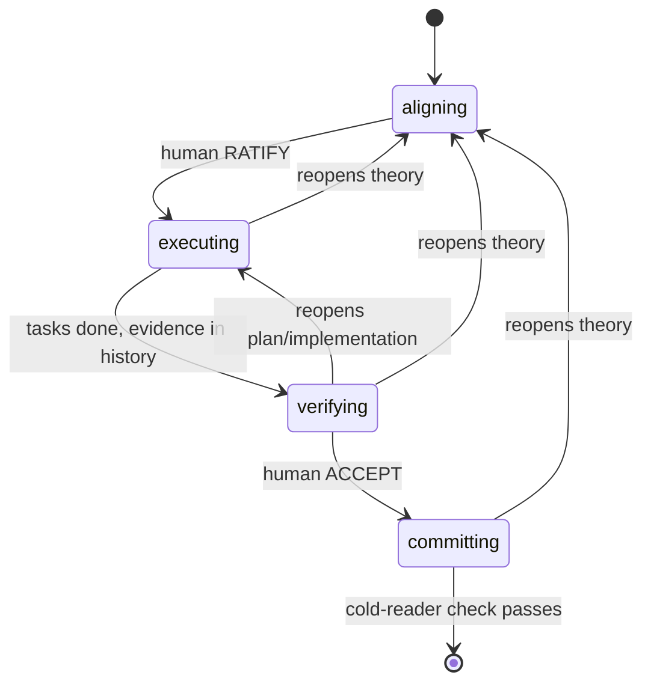

<!-- THROWAWAY PROTOTYPE — drafted from the dddv2 delta's Theory for behavioral evals; not the shipped skill. -->

# dddv2 — Delta-Driven Development

## Overview

A delta is a human-aligned unit of change: an *alignment-preserving transaction on a shared theory*. It opens only when human and agent share a theory of the change (goal, constraints, approach, measure); it aborts back to alignment the moment reality contradicts the theory; it commits atomically — code, durable context, and the human's understanding advance together, or it isn't done. The alignment bar is Naur's (*Programming as Theory Building*): the real program is the theory its team holds, which text alone cannot carry — aligned means the human could predict the plan, could even write the code themselves.

All state lives in one file, `.deltas/<name>.md` — the sole inter-session memory and every subagent's briefing. Routing is syntactic: frontmatter `state` alone decides where you are, because "is this done?" cannot be trusted to the doer. States model **authority**, not activity:

## When to Use

The default for non-trivial work: enter whenever the change needs a theory. Skip only when the change is one sentence with one obvious implementation. Size bound: `## Theory` + `## Acceptance` fit one screen — the ratification surface is the sizing function; bigger ambitions become sequential deltas, no hierarchies, no epics. A cold session resumes by frontmatter `state`, nothing else.

## Core Process

### 1. Route, then conduct

Find or create `.deltas/<name>.md` (new: `state: aligning`, `ratified: null`). At every state entry, load that state's skills explicitly with the Skill tool — explicit loading is structural recall; spontaneous memory degrades silently. Each state's boundary check is **never run by the artifact's author** — an author's verdict on its own work is self-report, not evidence:

| State (authority) | Loads | Work | Boundary check (non-author) |
|---|---|---|---|
| aligning (shared; human gates exit) | design-it-twice, define-errors-away | the aligning cycle (step 2) | **skeptic**, fresh context: refutes factual claims against the codebase, audits the theory checklist, lists questions unanswerable from delta + references → human dispositions and RATIFIES |
| executing (agent, within ratified theory) | deep-module-design, define-errors-away; per task: test-driven-development, comments-as-design | module boundaries → acceptance checks authored blind (a context that will never implement) → convergent decomposition → per task RED → GREEN → REFACTOR; failing-test commit precedes implementation commit, both reference the task id | **decomposition**: two independent contexts derive task lists from the delta alone — an invented assumption is a theory gap outright; a third judges divergence: material reopens theory, immaterial merges. Per task: pre-registered failing test + evidence in history |
| verifying (non-author lineage) | complexity-red-flags | run acceptance, attempt refutation, audit the diff | human ACCEPTs on the verifier's evidence |
| committing (agent) | comments-as-design | harvest via carriers; disposition followups | **cold reader** states what must remain true and why, from durable artifacts alone; a judge compares against frozen Theory |

Non-author = a context that produced none of the artifacts under check; a fresh subagent briefed with the delta qualifies, its briefing carrying the role's load line above. Checker bright lines:

- Checkers commit findings under a role git author (`dddv2-skeptic`, `dddv2-verifier`, …) — independence becomes auditable.
- Every spawned check records its role and harness-returned agent id in the delta-edit commit reporting it, auditable against transcripts. **A check with no spawn record did not happen.** Narrating a checker that was never spawned is forging evidence — if spawning is unavailable, declare a reduction (the legitimate path) or stop and say so.
- Checkers are **read-only on the shared working tree**: any checkout happens in a `git worktree` or exported tree (a checker's `git checkout` once stranded the shared checkout on a detached HEAD).

### 2. Aligning — build the theory together

Expand before converging: overgenerate questions and forks into `## Open`; investigate both channels — system AND human, either alone lies; consolidate into Theory each cycle. Ground load-bearing forks with stanced subagent designs (each under a distinct design philosophy) and prototype demos; never pick the winner of your own comparison nor judge your own divergences — forks go to the human. Reading is not theory-building: the human's theory forms by exercising artifacts, not reviewing prose — exercise load-bearing theory (prototype, demo, dry-run) before proposing ratification. Prototypes are the highest-bandwidth alignment channel ("The hardest single part of building a software system is deciding precisely what to build" — Brooks) and throwaway instruments; the system grows through tasks.

The human ratifies the measure before the optimizer runs; checks consume observables, never self-reports — "When a measure becomes a target, it ceases to be a good measure." Ratification itself is a Goodhart surface: it must not become aligning's target. Exit is a protocol, not a reflex — norm-shaped gate rules lose to completion pressure, so only bright lines bind:

1. **Quiescence** — a full cycle with no material theory change, `## Open` drained, nothing left to figure out downstream.
2. **Skeptic round** — challenges go to the human verbatim, in a message containing **no ratification request**.
3. Only after the human has dispositioned every challenge and every fork may ratification be requested — **standalone, in a later message**. The human ratifies: judgment, not a button.

Skeptic checklist (Theory stays prose — mandatory forms get filled to look complete): goal · domain entities (class diagram when the domain model changes) · approach with rejected alternatives · structure sketch · norms deviations · constraints, invariants, assumptions each with sensitivity · non-goals · risks. Operations excluded: the plan must be derivable — convergent decomposition tests exactly this — never dictated.

### 3. Human gates — quoted, never paraphrased

RATIFY and ACCEPT are words **only the human can write**. The commit crossing a human gate quotes the human's granting message verbatim; an agent-authored crossing is forgery regardless of work quality. The verifier's evidence is grounds for the human's ACCEPT, never a substitute — passive voice ("ACCEPTed on verifier evidence") launders an agent decision into a gate crossing.

### 4. Executing — transcription, not discovery

Discovery is confined to aligning, where figuring-out is cheap and disposable; what remains is reproducible and verifiable. Interfaces are designed before tasks to shrink the semantic surface; task boundaries = module boundaries, aimed deliberately. Mid-task discovery reopens the contradicted layer — never resolved silently.

**Layered backflow** (every state): work is layered theory → plan → implementation; any finding reopens the *lowest contradicted layer*. Which layer is your judgment, declared in the commit message of the delta edit recording it.

### 5. Verifying and committing

Verifying does the table's work in a non-author lineage; findings reopen via backflow; clean evidence goes to the human for ACCEPT. Committing harvests via carriers: boundary-why, contracts, module invariants → interface comments; behavioral contracts, regression guards → tests; cross-module theory, norm changes → architecture docs / CLAUDE.md; everything else dies with the delta — deltas are not archives. Disposition each `## Followups` entry with the human: new delta stub, tracker entry per project convention, or dropped explicitly. After the cold-reader check passes, close: a PR closes the delta when a remote exists; without one, the closing commit plus deletion is the whole close — git history is the archive.

### The delta file

Sections in this normative order, each readable by a third person with zero conversation context (comments-as-design's different-words test applies):

- Frontmatter `state` + `ratified` (ISO date set by the ratification commit; null before) — the only routing surface.
- `## Theory` + `## Acceptance` — the ratification screen. **Integrity rule:** after ratification both are immutable — frozen by name, not file position; editing either forces `state: aligning` and re-ratification. Other sections stay live by design.
- `## References` — each pointer with a one-line why.
- `## Open` — live questions and forks; drained before any ratification proposal.
- `## Tasks` — definitions only: description, inline acceptance check, `needs:` for ordering; ids short kebab-case, unique within the delta. **No status marks — a checked box is a self-report.** Completion is derived: commits referencing the task id exist and its acceptance check passes.
- `## Followups` — out-of-scope discoveries, accepted mid-work; the deferral valve is audited at committing.

Acceptance is falsifiability, not grammar: `criterion — check: <observable procedure>`. Behavioral criteria become failing executable checks before implementation; invariants become property tests or audits; non-code artifacts get scenario runs. Mock-theater is forbidden: "untestable without heavy mocks" is design feedback first (extract a functional core), logged exemption second.

**Log = git:** every consolidation and transition commits the delta file, log line as commit message — append-only by construction. Per-task evidence lives in the task's code commits.

### Margin

Rigid: what counts (the ratified measure), who checks (non-authors), gate authority, artifact integrity. Everything *how* — check intensity, task workspace (add/split/reorder tasks when derivable from ratified theory), parallelism, spikes, harvest selection — is your judgment, **declared in the delta, never silent**. Reductions are declared per check; no named tiers.

## Common Rationalizations

Each observed in a session or eval — real temptations, not hypotheticals.

| Excuse | Reality |
|---|---|
| "Work is solid — I'll send the skeptic's challenges and ask for RATIFY in one message." | The observed anti-pattern (eval S1): completion pressure beats norms. The challenge message carries no ratification request; the request comes standalone, later, post-disposition. |
| "The human clearly agrees — …and I'll ratify." | RATIFY is a word only the human can write (S1). |
| "ACCEPTed on verifier evidence." | Evidence is grounds for the human's ACCEPT, never a substitute (Opus S4: irreversibly closed). Quote the human or don't cross. |
| "I'll play the skeptic myself and report what it would find." | A narrated checker is forged evidence; no spawn record, no check. Declare a reduction or stop. |
| "This check is overkill here — I'll quietly scale it down." | Reductions are legitimate only when declared (S1: undeclared fork-grounding reduction). Silence steals a decision the human is owed. |
| "Mid-task the theory looks slightly off — I'll adapt as I code." | Executing is transcription; silent resolution buries the contradiction (a v1 failure). Reopen the contradicted layer, declared in the recording commit. |

## Red Flags

Observable symptoms, each from a recorded incident:

- One message contains both skeptic challenges and a ratification request.
- A gate-crossing commit lacks a verbatim quote of the human's RATIFY/ACCEPT message.
- A boundary check reported with no spawn record (role + agent id) in its reporting commit.
- The shared working tree changed — or sits on a detached HEAD — after a checker ran.
- A check reduced or skipped with no declaration in the delta.

## Verification

Confirm from artifacts, never memory:

- [ ] Delta file: frontmatter `state` + `ratified`, sections in normative order, third-person readable.
- [ ] Skills loaded via the Skill tool at each state entry.
- [ ] Every boundary check: non-author context, role git author, role + agent id in the reporting commit — or a declared reduction.
- [ ] Gate crossings quote the human verbatim; ratification was requested standalone, post-quiescence, after the human dispositioned all challenges and forks.
- [ ] `## Theory` + `## Acceptance` unchanged since ratification — or `state` returned to aligning.
- [ ] Per task: failing-test commit precedes implementation commit, both referencing the task id; acceptance checks pass.
- [ ] Close: followups dispositioned with the human, harvest in carriers, cold-reader check passed, delta deleted.
