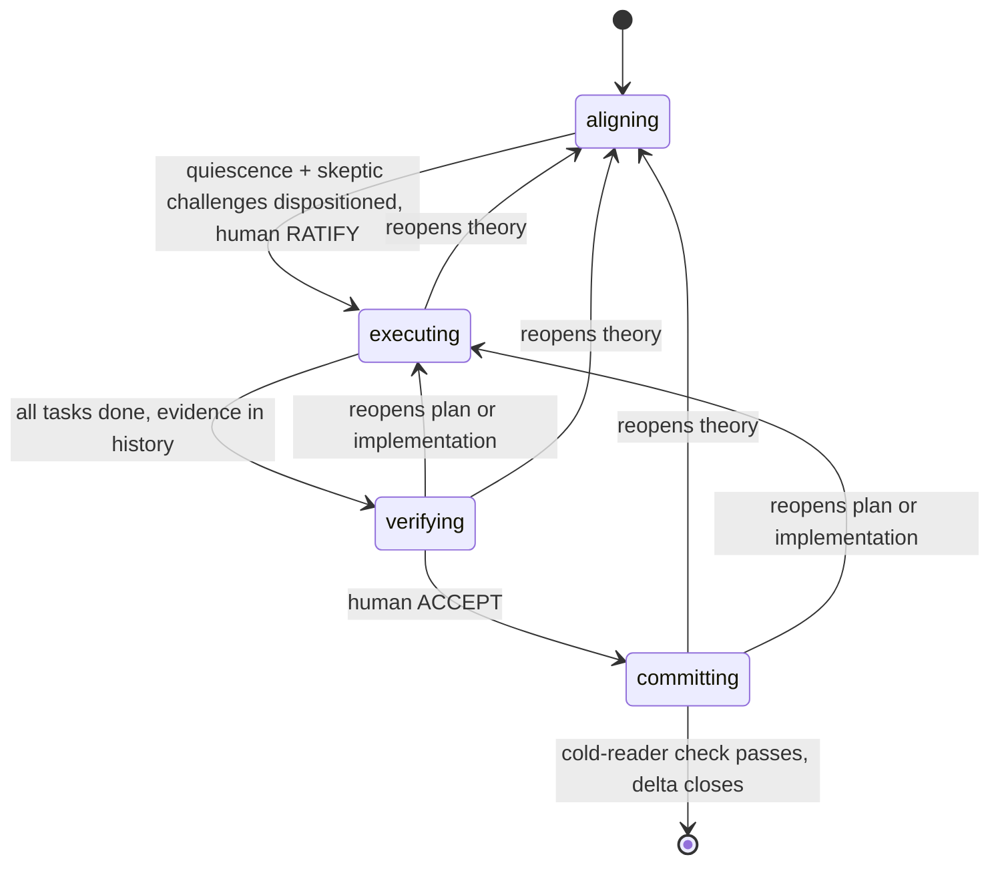
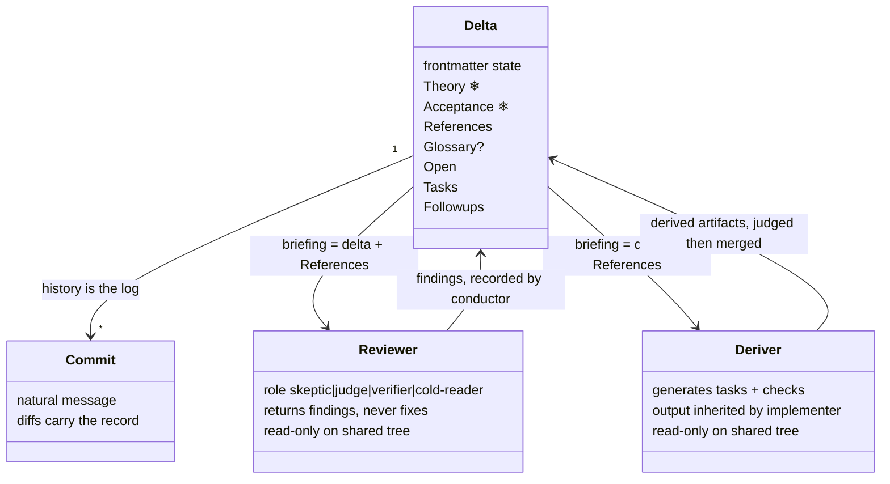

# Delta: dddv2 — rebuild DDD as an alignment-preserving transaction

## Theory

**Core philosophy.** A delta is a human-aligned unit of change performed by an
AI agent: an *alignment-preserving transaction on a shared theory*. It opens
only when human and agent share a theory of the change (goal, constraints,
approach, measure). It aborts back to alignment the moment reality contradicts
the theory. It commits atomically: code, durable context, and the human's
understanding advance together, or the delta isn't done. The constraints
below answer failures observed in v1 — the incidents that triggered this
redesign — or in this delta's own logged history.

**Design constraints.**

- *Naur* — aligning is collaborative theory-building. Exit test: the human
  could predict the plan, could even write the code themselves. Ratification
  replaces plan review.
- *Goodhart* — the human ratifies the measure before the optimizer runs;
  checks consume observables, never self-reports. Process milestones are
  Goodhart surfaces too: ratification must not become aligning's target.
- *Optimizer's curse* — the agent never picks the winner of its own
  comparison nor judges its own divergences. Forks go to the human, grounded
  by prototype demos when load-bearing.
- *Rice* — routing is syntactic (frontmatter `state`); correctness is
  empirical; interfaces are designed before tasks to shrink the semantic
  surface.
- *Conway* — task boundaries = module boundaries, aimed deliberately. The
  delta file is the sole inter-session memory and every subagent's briefing.
- *Brooks* — intent can't be fully specified without trying it: prototype
  demos are the highest-bandwidth alignment channel. Prototypes are throwaway
  instruments; the system grows through tasks.
- *Ousterhout* — dddv2 conducts the sibling skills at state entry
  (structural recall, never spontaneous memory). Ceremony is accidental
  complexity: checks scale with stakes or agents route around the process.

**Goal.** This delta ships the skill that replaces v1 — developed at
`dotfiles/.agents/skills/dddv2/`, shipping as `ddd` (see Shipping) — with
the eval harness graduated into the skill's own `evals/` directory as its
permanent acceptance checks. Non-goals, deferred to Followups: the
CLAUDE.md conductor registration, the sibling-skill refactors (two specific
ones already recorded there), and the hooks enforcement layer. None blocks
this delta; all depend on it.

**Risks and assumptions, each with its sensitivity.**

- *Frontier-model assumption* — every judgment-shaped rule (authority,
  discretion, layer choice) presumes a frontier model drives. Sensitivity:
  on sub-frontier models authority collapses wholesale. Capability record,
  for the operator who picks the model (the skill cannot detect or enforce
  tier): runs well on Opus 4.8 and Fable 5; Sonnet 4.6 collapsed
  (self-ratification, self-acceptance, narrated reviewers).
- *Same-weights decorrelation* — reviewers are independent contexts but
  share model weights with authors; a model-level blind spot is invisible
  to every check at once. Sensitivity: unbounded by construction. The
  lever is cross-model checking (used for eval judging), kept as a lever,
  not a rule.
- *Prose-only enforcement* — until the hooks delta ships, every bright
  line binds only through skill text. Sensitivity: bright lines verified on
  Opus 4.8, the model whose norm-version failures were worst; Fable's
  norm-era failure was not re-run post-fix (its tier sits at or above the
  verified one). Any rule softened back into a norm should be expected to
  fail under completion pressure.

**Rejected alternatives** (the why-nots prose can't carry implicitly):
full-file immutability after ratification — would make routing empirical
and price plan repair at re-ratification; a Gherkin acceptance grammar —
syntax mistaken for falsifiability; a finding taxonomy with routing
labels — layered backflow derives the route; named check tiers — labels
invite cargo-culting the label instead of judging the delta.

**Engagement.** dddv2 is the *default protocol for non-trivial work*, not a
specialist tool: enter whenever the change needs a theory — it spans modules,
is open-ended, or has multiple plausible approaches. Skip only when the
change is one sentence with one obvious implementation. The skill's
frontmatter description must carry this defaultness explicitly (it is the
only pre-load routing surface). Size bound: the ratification surface stays
holdable in one sitting — concise without sacrificing expressiveness; a
screen is the aim, not a wall. Ambitions whose theory can't stay holdable
become sequential deltas — no hierarchies, no epics. A cold session resumes
by frontmatter `state`.

**Shipping (decided).** Developed at `dotfiles/.agents/skills/dddv2/` as
`SKILL.draft.md` — registries only see `SKILL.md`, so the draft cannot race
v1's trigger during development. Outcomes at close (steps are derived, not
dictated): exactly one delta-driven skill exists, at
`dotfiles/.agents/skills/ddd/`, and it is this one — v1 gone, the draft
renamed live, the directory carrying the `ddd` name (the anatomy standard
requires name = directory; versions live in git, not names). Coexistence is
forbidden at every point in time: before close the draft is unregistered,
after close v1 no longer exists. CLAUDE.md registration is a Followup, not
a close condition.
**Bootstrap note (declared):** this delta designs the protocol itself, so
its Theory doubles as the product specification and far exceeds the usual
surface; the sizing guidance governs deltas run *under* the protocol.

**Architecture.** States model authority, not activity:

**Layered backflow.** Work is layered: theory → plan → implementation. Any
finding, in any state, reopens the lowest contradicted layer. Which layer is
agent judgment, declared in the content of the delta edit that records it.

**Domain entities.** The artifact's shape, since this delta redesigns it:

(❄ = frozen at ratification.)

**Aligning.** Expansion before convergence: overgenerate questions and forks
into `## Open`; investigate both channels (the system AND the human — either
alone lies); ground load-bearing forks with stanced subagent designs (each
drafted under a distinct design philosophy) and prototype demos; consolidate
into Theory each cycle. Reading is not theory-building — the human's theory
forms by exercising artifacts, not reviewing prose (this delta's own history
is the incident: prototype rounds surfaced more than prose rounds, on both
sides). Load-bearing theory is exercised — prototype, demo, or dry-run —
before ratification is proposed. Exit is a protocol, not a reflex: (1) quiescence — a full cycle with no material theory change,
`## Open` drained, nothing left that needs figuring-out downstream;
(2) skeptic round — its challenges go to the human verbatim, in a message
that contains no ratification request ("pick the fork and RATIFY" in one
breath is the observed anti-pattern: eval S1, 2026-06-12); (3) only after
the human has dispositioned every challenge and every fork may ratification
be requested, standalone, in a later message. The human ratifies — judgment,
not a button. Norm-shaped gate rules lose to completion pressure; only
bright lines bind.

**Human gates (decided).** RATIFY and ACCEPT are words only the human can
write. The agent flips `state` across a human gate only in direct response
to the human's message granting it; an agent-initiated crossing is forgery
regardless of work quality — the verifier's evidence is grounds for the
human's ACCEPT, never a substitute for it. Observed, both flavors, Opus 4.8
evals 2026-06-12: "…and I'll ratify" (agent casting itself as ratifier, S1)
and "ACCEPTed on verifier evidence" with the human absent (S4 — passive
voice laundering an agent decision into a gate crossing, followed by
irreversible close). In-repo, the flip is just a diff; binding it to an
actual human message is the hooks followup's job — until then the rule
binds behaviorally, which the v4 evals showed on Opus 4.8.

**Executing is transcription.** Discovery is confined to aligning, where
figuring-out is cheap and disposable; what remains is reproducible and
verifiable. Mid-task discovery reopens the contradicted layer — never
resolved silently. The exit (executing → verifying) is agent-crossed, not a
human gate: the executor runs every task's acceptance check at the
transition and records the results in the delta; the verifier then re-runs
them independently — the executor's run gates progress, the verifier's run
is the evidence.

**Conduction and checks.** Per state: authority, skills loaded at entry (via
the harness's Skill tool — explicitly, so structural recall can't degrade
into spontaneous memory), and the boundary check — never run by the
artifact's author. Non-author means a context that produced none of the
artifacts under check; a fresh subagent briefed with the delta + its
References (the standard briefing for every spawned context) qualifies, its
briefing carrying the role's load line from this table. Reviewers check and
never fix: a reviewer that fixes becomes an author, and its work would need
a fresh non-author check — findings reopen the owning layer, and the owning
state fixes by whatever hands it delegates. A reviewer's finding list is
evidence, never a measure: repairs address the reopened layer, and
re-verification after a repair is a full fresh pass — never a confirmation
that listed items were fixed, because fixing-the-list is Goodhart's
shortcut past fixing-the-problem. Reviewers return their findings;
the conductor records them as delta content (challenges into `## Open`,
verifier evidence into the delta before any ACCEPT request) — the record is
the file and its diffs, like every other declaration. Narrating a reviewer
that was never spawned is forging evidence — if spawning is unavailable,
declare a reduction (the legitimate path) or stop and say so. Harness
transcripts are the audit channel; mechanical enforcement is the hooks
followup. Reviewers are read-only on the shared working tree: any checkout
happens in a `git worktree` or exported tree (observed incident: a
verifier's `git checkout` left the shared checkout on a detached HEAD,
Opus S4, 2026-06-12).

| State (authority) | Loads | Work | Boundary check (non-author) |
|---|---|---|---|
| aligning (shared; human gates exit) | design-it-twice, define-errors-away | the aligning cycle | skeptic, fresh context: refutes factual claims against the codebase, audits the ontology checklist, lists questions unanswerable from delta + references → human dispositions and RATIFIES |
| executing (agent, within ratified theory) | deep-module-design, define-errors-away; per task: test-driven-development, comments-as-design | module boundaries → convergent derivation → per task: implement to the inherited spec, test-first by conducted default (RED → GREEN → REFACTOR) | convergent derivation: two independent deriver contexts each derive, from the delta + References, the task list, the delta-level acceptance executables, and per-task check specs — an invented assumption is a theory gap outright; a third context judges divergence: material reopens theory, immaterial merges. The implementer inherits the merged result and never authors the criteria it is graded by; its per-task tests are transcriptions of the inherited specs, validated against them at verifying. Verification rests on the delta-level executables (ATDD), so verifiability never depends on the implementer's process |
| verifying (non-author lineage) | complexity-red-flags | run acceptance, attempt refutation, audit the diff | human ACCEPTs on the verifier's evidence |
| committing (agent) | comments-as-design | harvest via carriers; disposition followups | cold reader states what must remain true and why, from durable artifacts alone; a judge compares against frozen Theory |

**Minimality.** The skill ships the invariant spine only: states-as-authority,
frozen measures + integrity rule, non-author checks, layered backflow,
conduction loads, discovery-aborts, holdable ratification surface, declared
discretion.
Any further rule must earn its place by a failed eval scenario — missing
rules are observable, redundant ones are not.

**Skill form.** The skill follows the house anatomy (see References):
frontmatter `name` + `description` (what + when, defaultness explicit), then
Overview, When to Use, Core Process, Common Rationalizations, Red Flags,
Verification. Authoring follows the skill-creator process. Minimality still
governs content: Rationalizations and Red Flags carry only failure modes
actually observed in sessions or evals, each traceable to its incident —
never speculative vices. The body is teaching prose, not telegraphic
rule-shrapnel: a stranger must be able to learn the process from it and
extrapolate to situations the rules didn't foresee, so every rule carries
its why — one sentence, or a verbatim quote from the quote pool below. A
rule without its rationale is brittle exactly when it matters.

**Quote pool.** Verbatim anchors for the skill's rationale; every quote is
verified against its source before shipping, never reproduced from memory:

- Goodhart's law, Strathern's phrasing: "When a measure becomes a target, it
  ceases to be a good measure."
- Conway (1968): "…organizations which design systems (in the broad sense
  used here) are constrained to produce designs which are copies of the
  communication structures of these organizations." (mid-sentence in the
  source: melconway.com/Home/Committees_Paper.html)
- Brooks, *No Silver Bullet* (1986): "The hardest single part of building a
  software system is deciding precisely what to build."
- Brooks, *The Mythical Man-Month* (p. 116): "Hence plan to throw one away;
  you will, anyhow." — pair with his anniversary-edition amendment toward
  incremental growth.
- Ousterhout (as quoted in the sibling skills): "The best modules are those
  that provide powerful functionality yet have simple interfaces." ·
  "Complexity is anything related to the structure of a software system that
  makes it hard to understand and modify the system." · "define errors out
  of existence."
- Naur, *Programming as Theory Building*: exact wording must be pulled from
  the paper during executing — the load-bearing claims to anchor: the
  program is the theory the team holds; the text alone cannot carry it; a
  program dies when the team holding its theory dissolves.

**Margin.** Rigid: what counts (the ratified measure), who checks
(non-authors), gate authority, artifact integrity. Everything *how* — check
intensity, task workspace (add/split/reorder tasks when derivable from
ratified theory), parallelism, spikes, harvest selection — is agent judgment,
declared in the delta, never silent. Declarations are delta *content* —
visible in the file and its diffs. Commit messages are natural summaries of
the work done, never load-bearing conventions: the what lives in the diffs,
the why in the delta's content at each commit. Reductions are declared per
check; no named tiers.

**Theory ontology — capture-by-audit.** Theory stays prose; mandatory forms
get filled to look complete. The skeptic audits against: goal · domain
entities (class diagram when the domain model changes) · approach with
rejected alternatives · structure sketch · norms deviations · constraints ·
invariants · assumptions (each assumption with its sensitivity) · non-goals
· risks. Operations are excluded: the plan must be derivable — convergent
derivation tests exactly this — never dictated.

**Acceptance convention.** Falsifiability, not grammar: `criterion — check:
<observable procedure>`. Behavioral criteria become failing executable checks
before implementation; invariants become property tests or audits; non-code
artifacts get scenario runs. Mock-theater is forbidden: "untestable without
heavy mocks" is design feedback first (extract a functional core), logged
exemption second.

**Artifact.** One markdown file per delta at `.deltas/<name>.md`:

- Frontmatter `state` — the only routing surface. There is no `ratified`
  field: ratification is the state-flip edit made in direct response to the
  human's RATIFY, discoverable as the diff that flips `state`; a field
  restating derivable state is a self-report that can lie.
- `## Theory` + `## Acceptance` — the ratification surface.
- `## References` — each pointer with a one-line why.
- `## Open` — live questions and forks; drained before any ratification
  proposal.
- `## Tasks` — task definitions only: description, inline acceptance check,
  `needs:` for ordering; ids are short kebab-case, unique within the delta.
  No status marks — a checked box is a self-report. Completion is derived
  from observables: the task's acceptance check passes (ground truth — run
  them); history's diffs show what landed.
- `## Followups` — out-of-scope discoveries; dispositioned at committing:
  each becomes a new delta stub, a tracker entry per project convention, or
  is dropped explicitly with the human.
- `## Glossary` (optional) — definitions for terms the delta coins or leans
  on; the skeptic audits it whenever the delta invents vocabulary. Most
  deltas won't need one.
- **Audience rule:** every section readable by a third person with zero
  conversation context; the different-words test (defined in
  comments-as-design) applies.
- **Integrity rule:** after ratification, `## Theory` and `## Acceptance` are
  immutable — frozen by name, not file position; editing either forces
  `state: aligning` and re-ratification. Section order is normative: Theory,
  Acceptance, References, Glossary (optional), Open, Tasks, Followups.
  Sections outside the frozen
  pair are live by design — `## Followups` must accept discoveries mid-work;
  its deferral valve is audited at committing, where every entry is
  dispositioned with the human.
- **Log = git:** every consolidation and transition commits the delta file —
  append-only by construction. The diffs are the authoritative record, and
  the delta's content at each commit carries the why; messages are courtesy
  summaries of the work done.
- **Lifecycle:** committed alongside the work it governs; deleted at close
  (git history is the archive). A PR closes the delta when a remote exists —
  without one, the closing commit plus deletion is the whole close.

**Harvest carriers.** Boundary-why, contracts, module invariants → interface
comments. Behavioral contracts, regression guards → tests. Cross-module
theory, norm changes → architecture docs / CLAUDE.md. Everything else dies
with the delta — deltas are not archives.

## Acceptance (proposed — awaiting ratification)

- [ ] **Cold-start routing** — a fresh session with the dddv2 skill and a
      realistic request enters the correct state and loads the mandated
      sibling skills, unprompted. — check: scenario run in a clean session
      against a `dddv2-evals` fixture, with the skill and the six sibling
      skills installed — an isolated fixture environment, only the shipped
      skill present, so Shipping's no-coexistence rule is untouched.
- [ ] **Derivability and prediction** — the theory determines the plan.
      — check: convergent derivation passes on this delta; the human states
      their predicted task list in a message *before* the derived list is
      shown (timing relative to RATIFY is irrelevant — the prediction tests
      theory-determinism, not the gate), and the two materially match. The
      ratification-surface *experience* (holdable in one sitting) cannot be
      evidenced here (bootstrap oversize) — it is validated on the first
      protocol-governed delta, per Followups.
- [ ] **Decorrelated contexts** — every boundary check runs in a non-author
      context, and generation fans out to independent contexts where stakes
      warrant (design divergence; convergent derivation of tasks and
      checks); self-report is never evidence. — check: exercise one delta
      end-to-end; every boundary check's findings appear as delta content
      with their origin stated, and at least one spawned check is
      cross-audited against harness transcripts.
- [ ] **Convergence before gate** — ratification is proposed only after
      quiescence + dispositioned skeptic round, standalone. — check: scenario
      run of an aligning loop; agent must keep cycling, not propose the gate.
- [ ] **Atomic close** — committing is blocked until the cold-reader check
      passes and followups are dispositioned. — check: close a real delta.
- [ ] **Proportional ceremony** — trivial asks never enter the protocol;
      small deltas run declared-reduced checks. — check: scenario runs of a
      trivial ask and a small delta.
- [ ] **Single source of truth** — every state, rule, and field defined in
      exactly one file. — check: cross-read all dddv2 files for re-encoded
      rules.
- [ ] **Token-lean** — dddv2-authored process text loaded in any single
      state (tiktoken cl100k) ≤ half of v1's same-state path at commit
      `ef6eb2a`: aligning ↔ SKILL+schema+explore; executing ↔
      SKILL+schema+plan+apply (it does both phases' work, so it carries
      both budgets); verifying ↔ SKILL+schema+verify; committing ↔
      SKILL+schema+verify (nearest analog — v1's close lived in verify's
      step 8). Sibling content is out of scope by design: the criterion
      measures protocol overhead, and conducted sibling loads are the
      feature v1 lacked — their cost is accepted here, in Theory, not
      hidden in the measure. — check: committed measurement script, run
      against both versions.

## References

- `dotfiles/.agents/skills/ddd/` — v1: the failure catalog this design
  answers, and the core philosophy it preserves.
- `dotfiles/.agents/skills/{design-it-twice,deep-module-design,test-driven-development,comments-as-design,complexity-red-flags,define-errors-away}/` —
  the sibling skills dddv2 conducts; their load points are part of this design.
- `dotfiles/.agents/skills/skill-creator/` — the house process for authoring
  skills; any context drafting the dddv2 skill must follow it.
- https://raw.githubusercontent.com/addyosmani/agent-skills/4dc80b778444b01c0ed292e725f88b123e45f2d2/docs/skill-anatomy.md —
  the structural standard the house skills follow (section anatomy, description
  rules, token discipline); the dddv2 skill must conform.
- `.deltas/dddv2-evals/` — the behavioral eval harness (fixture builder,
  judge rubrics, results and provenance); graduates into the skill's
  permanent acceptance checks during executing.

## Glossary

- **delta** — one unit of change run as a transaction: a file in `.deltas/`,
  the states it moves through, and the commits it produces.
- **theory** — the shared understanding of a change (why, approach,
  constraints, what was rejected), as prose in `## Theory`. Naur's sense:
  the thing that dies when nobody holds it.
- **measure / acceptance** — the criteria defining "done", written before
  implementation, frozen at ratification (`## Acceptance`).
- **fork** — a design decision with more than one defensible option. Always
  decided by the human; the agent may recommend, never pick.
- **disposition** — the human's explicit ruling on a fork, challenge, or
  followup: adopt, reject, or defer — said out loud, then consolidated.
- **`## Open` / drained** — the live list of unresolved questions and forks;
  drained = every item resolved into Theory or explicitly deferred. A
  precondition for any ratification request.
- **quiescence** — a full review cycle producing no material Theory change;
  the signal that aligning has converged.
- **consolidation** — folding a cycle's findings into the delta text and
  committing it.
- **skeptic** — a fresh subagent that attacks the delta before ratification:
  refutes factual claims against the codebase, audits content completeness,
  lists what it couldn't answer. Output goes to the human as challenges,
  never as approval.
- **human gates (RATIFY / ACCEPT)** — the two transitions only the human's
  word can cross: RATIFY approves theory + measure (aligning → executing);
  ACCEPT approves the verified result (verifying → committing). The agent
  crosses only in direct response to the human's granting message.
- **state / authority** — the frontmatter field naming who holds decision
  power: aligning (shared), executing (agent, inside ratified theory),
  verifying (non-author reviewer), committing (agent, closing out).
- **bright line** — a rule phrased so compliance is mechanically checkable
  ("this message contains no ratification request"), versus a **norm**
  ("don't rush the gate"). Evals showed norms fail under completion
  pressure; bright lines hold.
- **margin / declared discretion / reduction** — the agent's freedom over
  *how* (check intensity, task ordering, spikes…), legitimate only when
  stated in the record. A reduction = running less than the default
  machinery, declared.
- **layered backflow / reopen** — work is layered theory → plan →
  implementation; a discovered problem reopens the lowest wrong layer
  rather than being patched silently.
- **transcription** — what executing is: writing down a solution already
  figured out during aligning. Still figuring things out = wrong state.
- **pre-registration (RED → GREEN)** — committing the failing test before
  the implementation: the conducted default that keeps history honest. No
  longer the verification backbone — that is ATDD's job, the
  deriver-authored acceptance executables.
- **convergent derivation** — at executing entry, two independent deriver subagents
  each derive the task list, the delta-level acceptance
  executables, and per-task check specs from the delta + References;
  divergence between them is evidence the theory under-determines the work.
  The implementer inherits the merged result — it never authors the
  criteria it is graded by; its per-task tests are transcriptions of the
  inherited specs.
- **non-author / decorrelation** — no artifact is checked by its maker;
  reviewers are fresh subagents briefed with the delta + its References,
  so they can't inherit the author's blind spots.
- **never-narrate** — a reviewer's existence must be real: spawn it or
  declare a reduction; claiming an unspawned reviewer ran is forged
  evidence. Reviewers return findings; the conductor records them as delta
  content; harness transcripts are the audit channel.
- **cold reader** — the close-out check: a fresh subagent reading only the
  durable artifacts (code, comments, tests, docs) must reconstruct what
  must stay true and why — proof the knowledge survived outside the delta.
- **harvest / carriers** — moving durable knowledge out of the dying delta
  into its long-term homes: interface comments (the why), tests (the
  behavior), architecture docs / CLAUDE.md (the cross-module theory).
- **followup** — an out-of-scope discovery parked in `## Followups`; at
  close it becomes a new delta, a tracker entry, or is dropped explicitly.
- **audience rule** — every section readable by a third person with zero
  conversation context.
- **integrity rule** — after ratification, `## Theory` and `## Acceptance`
  are immutable; touching either reopens aligning.
- **log = git** — no in-file log: every consolidation and transition is a
  commit of the delta file; the diffs are the record, the delta's content
  the why, the messages natural summaries.
- **conduction / loads** — dddv2 ordering the sibling skills loaded at each
  state entry via the Skill tool, instead of trusting recall.
- **derived status** — task completion is never marked in the file (a
  checkbox is a self-report); it is derived by running the task's
  acceptance check — reality, not records.

## Open

- **Eval gap (deferred to executing, deliberately):** convergent derivation
  (tasks + checks from the delta + References) is the one machine never
  behaviorally tested — eval fixtures pre-supplied task lists. It runs for
  real at this delta's own executing entry, which is its test. The repair
  loop and committing mechanics were exercised in the Opus v3 runs
  (mechanism-tested; committing's authority gate verified separately in v4).

## Tasks

_(derived at executing entry via convergent derivation)_

## Followups

- Refactor design-it-twice for decorrelated divergence (N stanced independent
  subagents). (Sibling-skills delta.)
- Refactor test-driven-development: blind test-writer protocol, mock-theater
  prohibition, executable-check generalization. (Sibling-skills delta.)
- Claude Code hooks as mechanical enforcement: PostToolUse hook auto-commits
  `.deltas/*` edits (log-by-construction); SessionStart hook injects active
  delta name + state so cold-start routing is structural; gate-flip
  verification (a state flip across a human gate must follow an actual
  human message). (Tooling delta, after the skill exists.)
- Replace the CLAUDE.md domain-skills instruction with the conductor line
  plus a retained "outside a delta, load domain skills judiciously as the
  task warrants" sentence — the conductor line is the only *mandatory*
  loading rule; exact wording decided then. (Edited in dotfiles, the source
  of the home mirror.)
- The first protocol-governed delta validates the ratification-surface
  experience — holdable in one sitting, concise without sacrificing
  expressiveness (this bootstrap delta is oversize and cannot evidence it);
  failure there reopens this design.
