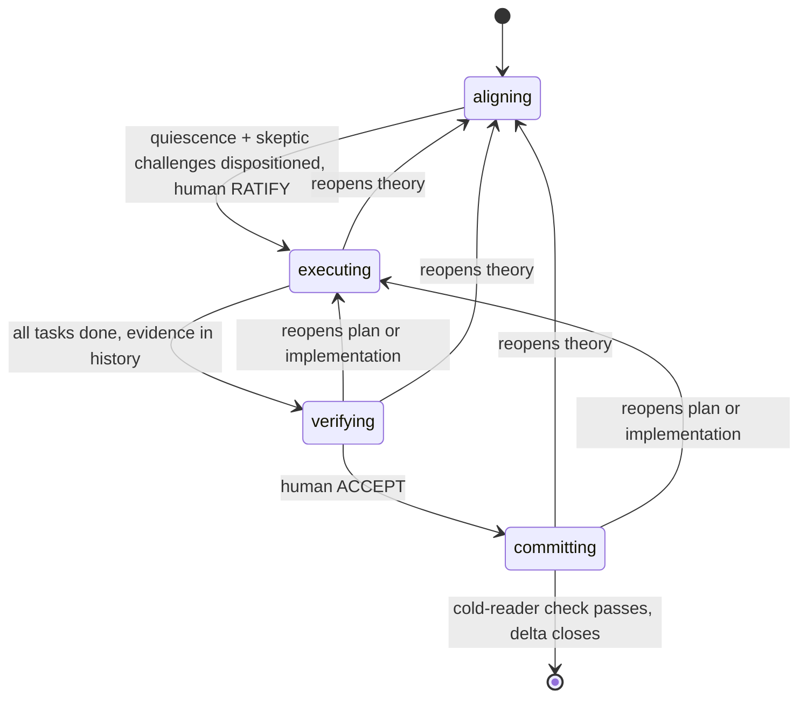

# Delta: dddv2 — rebuild DDD as an alignment-preserving transaction

## Theory

**Core philosophy.** A delta is a human-aligned unit of change performed by an
AI agent: an *alignment-preserving transaction on a shared theory*. It opens
only when human and agent share a theory of the change (goal, constraints,
approach, measure). It aborts back to alignment the moment reality contradicts
the theory. It commits atomically: code, durable context, and the human's
understanding advance together, or the delta isn't done. The constraints
below answer failures observed in v1 — the incidents that triggered this
redesign — or in this delta's own logged history.

**Design constraints.**

- *Naur* — aligning is collaborative theory-building. Exit test: the human
  could predict the plan, could even write the code themselves. Ratification
  replaces plan review.
- *Goodhart* — the human ratifies the measure before the optimizer runs;
  checks consume observables, never self-reports. Process milestones are
  Goodhart surfaces too: ratification must not become aligning's target.
- *Optimizer's curse* — the agent never picks the winner of its own
  comparison nor judges its own divergences. Forks go to the human, grounded
  by prototype demos when load-bearing.
- *Rice* — routing is syntactic (frontmatter `state`); correctness is
  empirical; interfaces are designed before tasks to shrink the semantic
  surface.
- *Conway* — task boundaries = module boundaries, aimed deliberately. The
  delta file is the sole inter-session memory and every subagent's briefing.
- *Brooks* — intent can't be fully specified without trying it: prototype
  demos are the highest-bandwidth alignment channel. Prototypes are throwaway
  instruments; the system grows through tasks.
- *Ousterhout* — dddv2 conducts the sibling skills at state entry
  (structural recall, never spontaneous memory). Ceremony is accidental
  complexity: checks scale with stakes or agents route around the process.

**Engagement.** dddv2 is the *default protocol for non-trivial work*, not a
specialist tool: enter whenever the change needs a theory — it spans modules,
is open-ended, or has multiple plausible approaches. Skip only when the
change is one sentence with one obvious implementation. The skill's
frontmatter description must carry this defaultness explicitly (it is the
only pre-load routing surface), and shipping includes registering dddv2 as
the conductor in the user's CLAUDE.md domain-skills instruction. Size bound:
Theory + Acceptance fit one screen; bigger ambitions become sequential
deltas — no hierarchies, no epics. A cold session resumes by frontmatter
`state`.

**Shipping (decided).** Developed at `dotfiles/.agents/skills/dddv2/`; ships
by replacement: at this delta's close, `ddd/` (v1) is deleted and `dddv2/`
is renamed to `ddd/` — the skill keeps the `ddd` name (the anatomy standard
requires name = directory; versions live in git, not names), and coexistence
is forbidden (two skills would race the same `.deltas/` trigger). Close also
replaces the CLAUDE.md domain-skills instruction (edited in dotfiles, the
source of the home mirror) with a single conductor line delegating per-state
skill loading to `ddd`, so load rules live in exactly one place.
**Bootstrap exemption (declared):** this delta designs the protocol itself,
so its Theory doubles as the product specification and exceeds the
one-screen bound; that bound governs deltas run *under* the protocol.

**Architecture.** States model authority, not activity:

**Layered backflow.** Work is layered: theory → plan → implementation. Any
finding, in any state, reopens the lowest contradicted layer. Which layer is
agent judgment, declared in the content of the delta edit that records it.

**Aligning.** Expansion before convergence: overgenerate questions and forks
into `## Open`; investigate both channels (the system AND the human — either
alone lies); ground load-bearing forks with stanced subagent designs (each
drafted under a distinct design philosophy) and prototype demos; consolidate
into Theory each cycle. Reading is not theory-building — the human's theory
forms by exercising artifacts, not reviewing prose (this delta's own history
is the incident: prototype rounds surfaced more than prose rounds, on both
sides). Load-bearing theory is exercised — prototype, demo, or dry-run —
before ratification is proposed. Exit is a protocol, not a reflex: (1) quiescence — a full cycle with no material theory change,
`## Open` drained, nothing left that needs figuring-out downstream;
(2) skeptic round — its challenges go to the human verbatim, in a message
that contains no ratification request ("pick the fork and RATIFY" in one
breath is the observed anti-pattern: eval S1, 2026-06-12); (3) only after
the human has dispositioned every challenge and every fork may ratification
be requested, standalone, in a later message. The human ratifies — judgment,
not a button. Norm-shaped gate rules lose to completion pressure; only
bright lines bind.

**Human gates are quoted, never paraphrased (decided).** RATIFY and ACCEPT
are words only the human can write. The commit that crosses a human gate
quotes the human's granting message verbatim; an agent-authored crossing is
forgery regardless of work quality. Observed, both flavors, Opus 4.8 evals
2026-06-12: "…and I'll ratify" (agent casting itself as ratifier, S1) and a
commit reading "ACCEPTed on verifier evidence" with the human absent (S4 —
the verifier's evidence is grounds for the human's ACCEPT, never a
substitute for it; passive voice laundered an agent decision into a gate
crossing, then the delta was irreversibly closed).

**Executing is transcription.** Discovery is confined to aligning, where
figuring-out is cheap and disposable; what remains is reproducible and
verifiable. Mid-task discovery reopens the contradicted layer — never
resolved silently.

**Conduction and checks.** Per state: authority, skills loaded at entry (via
the harness's Skill tool — explicitly, so structural recall can't degrade
into spontaneous memory), and the boundary check — never run by the
artifact's author. Non-author means a context that produced none of the
artifacts under check; a fresh subagent briefed with the delta qualifies,
and its briefing carries the role's load line from this table. Checker
contexts commit their findings under a role git author (`dddv2-skeptic`,
`dddv2-verifier`, …): independence becomes auditable — a convention, not a
proof; harness-level enforcement lives in the hooks followup. Process
execution is itself an observable: every spawned check records its role and
the harness-returned agent id as a line in the delta itself — content,
diffable, placement a matter of judgment — and the checker's own commits
carry its role git author. What matters is the append-only record, auditable
against harness transcripts. A check with no spawn
record did not happen. Narrating a checker that was never spawned is forging
evidence — if spawning is unavailable, either declare a reduction (the
legitimate path) or stop and say so. Checker contexts are read-only on the
shared working tree: any checkout they need happens in a `git worktree` or
exported tree (observed incident: a verifier's `git checkout` left the
shared checkout on a detached HEAD, Opus S4, 2026-06-12).

| State (authority) | Loads | Work | Boundary check (non-author) |
|---|---|---|---|
| aligning (shared; human gates exit) | design-it-twice, define-errors-away | the aligning cycle | skeptic, fresh context: refutes factual claims against the codebase, audits the ontology checklist, lists questions unanswerable from delta + references → human dispositions and RATIFIES |
| executing (agent, within ratified theory) | deep-module-design, define-errors-away; per task: test-driven-development, comments-as-design | module boundaries → convergent derivation → per task: RED → GREEN → REFACTOR (the failing-test commit precedes the implementation commit; both reference the task id) | convergent derivation: two independent contexts each derive, from the delta alone, the task list AND the executable checks (delta-level acceptance executables, per-task check specs) — an invented assumption is a theory gap outright; a third context judges divergence: material reopens theory, immaterial merges. The implementer inherits the merged checks and never authors the measure it is graded by. Per task: pre-registered failing test (written to the inherited spec) + evidence in commit history |
| verifying (non-author lineage) | complexity-red-flags | run acceptance, attempt refutation, audit the diff | human ACCEPTs on the verifier's evidence |
| committing (agent) | comments-as-design | harvest via carriers; disposition followups | cold reader states what must remain true and why, from durable artifacts alone; a judge compares against frozen Theory |

**Minimality.** The skill ships the invariant spine only: states-as-authority,
frozen measures + integrity rule, non-author checks, layered backflow,
conduction loads, discovery-aborts, one-screen sizing, declared discretion.
Any further rule must earn its place by a failed eval scenario — missing
rules are observable, redundant ones are not.

**Skill form.** The skill follows the house anatomy (see References):
frontmatter `name` + `description` (what + when, defaultness explicit), then
Overview, When to Use, Core Process, Common Rationalizations, Red Flags,
Verification. Authoring follows the skill-creator process. Minimality still
governs content: Rationalizations and Red Flags carry only failure modes
actually observed in sessions or evals, each traceable to its incident —
never speculative vices. The body is teaching prose, not telegraphic
rule-shrapnel: a stranger must be able to learn the process from it and
extrapolate to situations the rules didn't foresee, so every rule carries
its why — one sentence, or a verbatim quote from the quote pool below. A
rule without its rationale is brittle exactly when it matters.

**Quote pool.** Verbatim anchors for the skill's rationale; every quote is
verified against its source before shipping, never reproduced from memory:

- Goodhart's law, Strathern's phrasing: "When a measure becomes a target, it
  ceases to be a good measure."
- Conway (1968): "…organizations which design systems (in the broad sense
  used here) are constrained to produce designs which are copies of the
  communication structures of these organizations." (mid-sentence in the
  source: melconway.com/Home/Committees_Paper.html)
- Brooks, *No Silver Bullet* (1986): "The hardest single part of building a
  software system is deciding precisely what to build."
- Brooks, *The Mythical Man-Month* (p. 116): "Hence plan to throw one away;
  you will, anyhow." — pair with his anniversary-edition amendment toward
  incremental growth.
- Ousterhout (as quoted in the sibling skills): "The best modules are those
  that provide powerful functionality yet have simple interfaces." ·
  "Complexity is anything related to the structure of a software system that
  makes it hard to understand and modify the system." · "define errors out
  of existence."
- Naur, *Programming as Theory Building*: exact wording must be pulled from
  the paper during executing — the load-bearing claims to anchor: the
  program is the theory the team holds; the text alone cannot carry it; a
  program dies when the team holding its theory dissolves.

**Margin.** Rigid: what counts (the ratified measure), who checks
(non-authors), gate authority, artifact integrity. Everything *how* — check
intensity, task workspace (add/split/reorder tasks when derivable from
ratified theory), parallelism, spikes, harvest selection — is agent judgment,
declared in the delta, never silent. Declarations are delta *content* —
visible in the file and its diffs — never commit-message conventions;
messages stay natural prose. Sole exception: commits crossing human gates
quote the human verbatim, the one convention that anchors authority.
Reductions are declared per check; no
named tiers.

**Theory ontology — capture-by-audit.** Theory stays prose; mandatory forms
get filled to look complete. The skeptic audits against: goal · domain
entities (class diagram when the domain model changes) · approach with
rejected alternatives · structure sketch · norms deviations · constraints,
invariants, assumptions each with sensitivity · non-goals · risks.
Operations are excluded: the plan must be derivable — convergent
decomposition tests exactly this — never dictated.

**Acceptance convention.** Falsifiability, not grammar: `criterion — check:
<observable procedure>`. Behavioral criteria become failing executable checks
before implementation; invariants become property tests or audits; non-code
artifacts get scenario runs. Mock-theater is forbidden: "untestable without
heavy mocks" is design feedback first (extract a functional core), logged
exemption second.

**Artifact.** One markdown file per delta at `.deltas/<name>.md`:

- Frontmatter `state` — the only routing surface. There is no `ratified`
  field: ratification is anchored by the RATIFY commit itself (the human's
  words, quoted, tamper-evident in history); a field restating derivable
  state is a self-report that can lie.
- `## Theory` + `## Acceptance` — the ratification screen.
- `## References` — each pointer with a one-line why.
- `## Open` — live questions and forks; drained before any ratification
  proposal.
- `## Tasks` — task definitions only: description, inline acceptance check,
  `needs:` for ordering; ids are short kebab-case, unique within the delta. No status marks — a checked box is a self-report.
  Completion is derived from observables: commits referencing the task id
  exist and the task's acceptance check passes. Cheap resume signal = commit
  refs; ground truth = the checks, run at gates.
- `## Followups` — out-of-scope discoveries; dispositioned at committing:
  each becomes a new delta stub, a tracker entry per project convention, or
  is dropped explicitly with the human.
- `## Glossary` (optional) — definitions for terms the delta coins or leans
  on; the skeptic audits it whenever the delta invents vocabulary. Most
  deltas won't need one.
- **Audience rule:** every section readable by a third person with zero
  conversation context; the different-words test (defined in
  comments-as-design) applies.
- **Integrity rule:** after ratification, `## Theory` and `## Acceptance` are
  immutable — frozen by name, not file position; editing either forces
  `state: aligning` and re-ratification. Section order is normative: Theory,
  Acceptance, References, Glossary (optional), Open, Tasks, Followups.
  Sections outside the frozen
  pair are live by design — `## Followups` must accept discoveries mid-work;
  its deferral valve is audited at committing, where every entry is
  dispositioned with the human.
- **Log = git:** every consolidation and transition commits the delta file,
  log line as commit message — append-only by construction. Per-task
  evidence lives in the task's code commits.
- **Lifecycle:** committed alongside the work it governs; deleted at close
  (git history is the archive). Commits reference task ids; a PR closes the
  delta when a remote exists — without one, the closing commit plus deletion
  is the whole close.

**Harvest carriers.** Boundary-why, contracts, module invariants → interface
comments. Behavioral contracts, regression guards → tests. Cross-module
theory, norm changes → architecture docs / CLAUDE.md. Everything else dies
with the delta — deltas are not archives.

## Acceptance (proposed — awaiting ratification)

- [ ] **Cold-start routing** — a fresh session given only the dddv2 skill and
      a realistic request enters the correct state and loads the mandated
      sibling skills, unprompted. — check: scenario run in a clean session.
- [ ] **One-screen ratify** — a delta is ratifiable from Theory + Acceptance
      alone. — check: convergent decomposition passes on a real delta;
      spot-check against the human's own prediction.
- [ ] **Decorrelated contexts** — every boundary check runs in a non-author
      context, and generation fans out to independent contexts where stakes
      warrant (design divergence; convergent derivation of tasks and
      checks); self-report is never evidence. — check: exercise one delta
      end-to-end; confirm each check's context.
- [ ] **Convergence before gate** — ratification is proposed only after
      quiescence + dispositioned skeptic round, standalone. — check: scenario
      run of an aligning loop; agent must keep cycling, not propose the gate.
- [ ] **Atomic close** — committing is blocked until the cold-reader check
      passes and followups are dispositioned. — check: close a real delta.
- [ ] **Proportional ceremony** — trivial asks never enter the protocol;
      small deltas run declared-reduced checks. — check: scenario runs of a
      trivial ask and a small delta.
- [ ] **Single source of truth** — every state, rule, and field defined in
      exactly one file. — check: cross-read all dddv2 files for re-encoded
      rules.
- [ ] **Token-lean** — dddv2-authored text loaded in any single state
      (tiktoken cl100k; sibling skills excluded — both versions load them)
      ≤ half of v1's same-state path: SKILL.md + delta-schema.md + that
      state's phase reference, at v1's last committed revision. — check:
      committed measurement script, run against both.

## References

- `dotfiles/.agents/skills/ddd/` — v1: the failure catalog this design
  answers, and the core philosophy it preserves.
- `dotfiles/.agents/skills/{design-it-twice,deep-module-design,test-driven-development,comments-as-design,complexity-red-flags,define-errors-away}/` —
  the sibling skills dddv2 conducts; their load points are part of this design.
- `dotfiles/.agents/skills/skill-creator/` — the house process for authoring
  skills; any context drafting the dddv2 skill must follow it.
- https://raw.githubusercontent.com/addyosmani/agent-skills/4dc80b778444b01c0ed292e725f88b123e45f2d2/docs/skill-anatomy.md —
  the structural standard the house skills follow (section anatomy, description
  rules, token discipline); the dddv2 skill must conform.
- `.deltas/dddv2-evals/` — the behavioral eval harness (fixture builder,
  judge rubrics, results and provenance); graduates into the skill's
  permanent acceptance checks during executing.

## Glossary

- **delta** — one unit of change run as a transaction: a file in `.deltas/`,
  the states it moves through, and the commits it produces.
- **theory** — the shared understanding of a change (why, approach,
  constraints, what was rejected), as prose in `## Theory`. Naur's sense:
  the thing that dies when nobody holds it.
- **measure / acceptance** — the criteria defining "done", written before
  implementation, frozen at ratification (`## Acceptance`).
- **fork** — a design decision with more than one defensible option. Always
  decided by the human; the agent may recommend, never pick.
- **disposition** — the human's explicit ruling on a fork, challenge, or
  followup: adopt, reject, or defer — said out loud, then consolidated.
- **`## Open` / drained** — the live list of unresolved questions and forks;
  drained = every item resolved into Theory or explicitly deferred. A
  precondition for any ratification request.
- **quiescence** — a full review cycle producing no material Theory change;
  the signal that aligning has converged.
- **consolidation** — folding a cycle's findings into the delta text and
  committing it.
- **skeptic** — a fresh subagent that attacks the delta before ratification:
  refutes factual claims against the codebase, audits content completeness,
  lists what it couldn't answer. Output goes to the human as challenges,
  never as approval.
- **human gates (RATIFY / ACCEPT)** — the two transitions only the human's
  word can cross: RATIFY approves theory + measure (aligning → executing);
  ACCEPT approves the verified result (verifying → committing). The crossing
  commit quotes the human verbatim.
- **state / authority** — the frontmatter field naming who holds decision
  power: aligning (shared), executing (agent, inside ratified theory),
  verifying (non-author checker), committing (agent, closing out).
- **bright line** — a rule phrased so compliance is mechanically checkable
  ("this message contains no ratification request"), versus a **norm**
  ("don't rush the gate"). Evals showed norms fail under completion
  pressure; bright lines hold.
- **margin / declared discretion / reduction** — the agent's freedom over
  *how* (check intensity, task ordering, spikes…), legitimate only when
  stated in the record. A reduction = running less than the default
  machinery, declared.
- **layered backflow / reopen** — work is layered theory → plan →
  implementation; a discovered problem reopens the lowest wrong layer
  rather than being patched silently.
- **transcription** — what executing is: writing down a solution already
  figured out during aligning. Still figuring things out = wrong state.
- **pre-registration (RED → GREEN)** — committing the failing test before
  the implementation, so "the test passed" is provable from commit order
  rather than taken on trust.
- **convergent derivation** — at executing entry, two independent subagents
  each derive the task list and the executable checks from the delta alone;
  divergence between them is evidence the theory under-determines the work.
  The implementer inherits the merged result, so it never authors the
  measure it is graded by.
- **non-author / decorrelation** — no artifact is checked by its maker;
  checkers are fresh subagents briefed only by the delta, so they can't
  inherit the author's blind spots.
- **narrated checker** — claiming a checker ran without spawning one.
  Forged evidence by definition.
- **spawn record / role author** — the audit trail proving a checker ran:
  its findings commit is authored as `dddv2-<role>`, and the reporting
  commit records the harness agent id.
- **cold reader** — the close-out check: a fresh subagent reading only the
  durable artifacts (code, comments, tests, docs) must reconstruct what
  must stay true and why — proof the knowledge survived outside the delta.
- **harvest / carriers** — moving durable knowledge out of the dying delta
  into its long-term homes: interface comments (the why), tests (the
  behavior), architecture docs / CLAUDE.md (the cross-module theory).
- **followup** — an out-of-scope discovery parked in `## Followups`; at
  close it becomes a new delta, a tracker entry, or is dropped explicitly.
- **audience rule** — every section readable by a third person with zero
  conversation context.
- **integrity rule** — after ratification, `## Theory` and `## Acceptance`
  are immutable; touching either reopens aligning.
- **log = git** — no in-file log: every consolidation and transition is a
  commit of the delta file, its message the log line.
- **conduction / loads** — dddv2 ordering the sibling skills loaded at each
  state entry via the Skill tool, instead of trusting recall.
- **derived status** — task completion is never marked in the file (a
  checkbox is a self-report); it is derived from task-id commits existing
  and the task's check passing.

## Open

- **Pending André (skeptic C6):** a Theory content pass adding what the
  ontology checklist requires and the prose currently lacks — risks
  (frontier-judgment dependence; checkers share model weights with authors;
  enforcement is prose until the hooks delta), the frontier-model assumption
  with its sensitivity (the Sonnet probe is what failure looks like), an
  explicit goal/scope paragraph, one-line rejected alternatives (full-file
  immutability, Gherkin, finding labels, named tiers), and a small class
  diagram of the delta artifact. Explained twice; awaiting go.
- **Pending André (skeptic C12):** make three acceptance checks executable —
  cold-start environment = the `dddv2-evals` fixture with the six siblings
  installed; the human's task-list prediction is captured in a message
  *before* the list is shown; at executing → verifying the executor runs and
  records all task checks, the verifier independently re-runs them.
  Explained twice; awaiting go.
- **Eval gap:** convergent derivation (tasks + checks from the delta alone)
  is the one machine never behaviorally tested — eval fixtures pre-supplied
  task lists. It runs for real at this delta's executing entry. The repair
  loop and committing mechanics were exercised in the Opus v3 runs
  (mechanism-tested; committing's authority gate verified separately in v4).

## Tasks

_(derived at executing entry via convergent decomposition)_

## Followups

- Refactor design-it-twice for decorrelated divergence (N stanced independent
  subagents). (Sibling-skills delta.)
- Refactor test-driven-development: blind test-writer protocol, mock-theater
  prohibition, executable-check generalization. (Sibling-skills delta.)
- Claude Code hooks as mechanical enforcement: PostToolUse hook auto-commits
  `.deltas/*` edits (log-by-construction); SessionStart hook injects active
  delta name + state so cold-start routing is structural. (Tooling delta,
  after the skill exists.)
