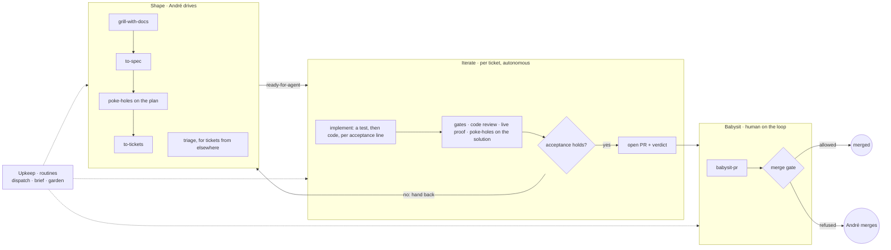
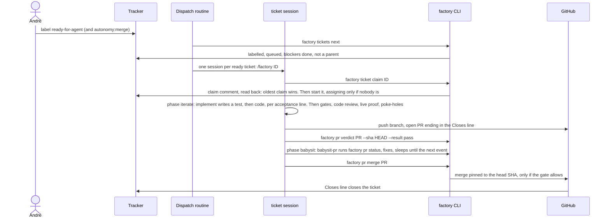
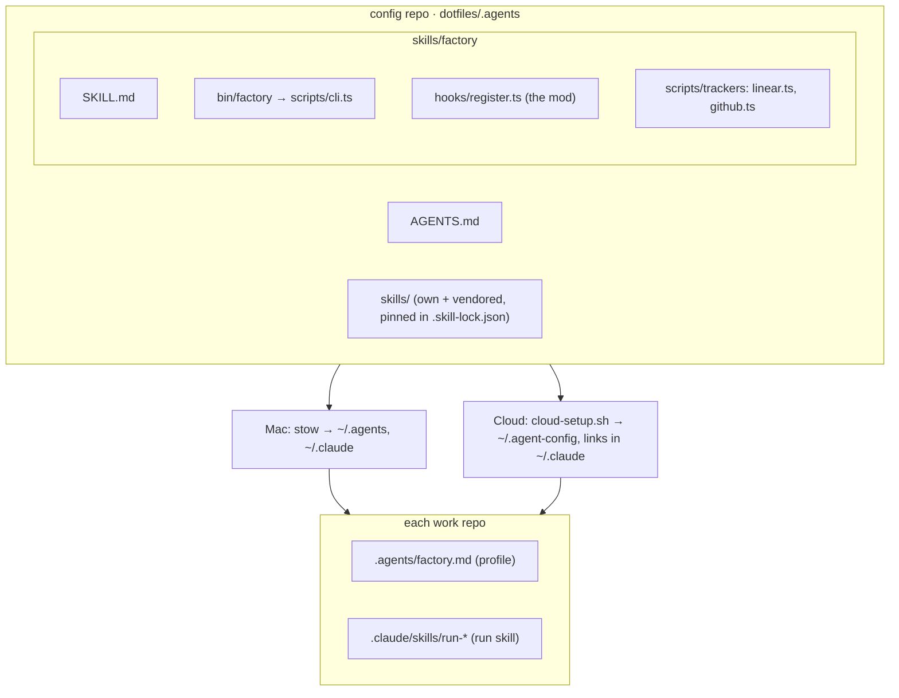

# Factory

The factory turns an approved ticket into a merged pull request with nobody
watching, and stops where only André can move it. It runs the same on the Mac
and in Claude Code cloud sessions, and reads tickets from Linear or GitHub
Issues. [INSIGHTS.md](INSIGHTS.md) lists the ideas behind it and where each came
from. Evals for its skills, and experiments still to run, live in
[andrezzoid/newsroom-evals](https://github.com/andrezzoid/newsroom-evals).

## Stages

| Stage | Driven by | Skills | Produces |
|---|---|---|---|
| Shape | André, interviewed | grilling, grill-with-docs, to-spec, poke-holes, to-tickets, triage | approved tickets with acceptance criteria and blocking edges |
| Iterate | an agent per ticket | implement, tdd, deep-module-design, define-errors-away, comments-as-design, code-review, complexity-red-flags, run, poke-holes, pr | a pull request whose acceptance runs as tests, with a recorded verdict |
| Babysit | an agent per pull request | babysit-pr, poke-holes | a merged pull request, or a brief saying what André must do |
| Upkeep | routines, or André | factory, retro, hillclimb, correct | started sessions, the standing brief, a garden log, new guards |

Shape is the only stage that changes what a ticket means. When Iterate finds
that acceptance cannot hold, it hands the ticket back instead of absorbing the
change, and André reshapes it. Shape is André's to drive, so André runs
poke-holes on a spec's draft before approving it: `to-spec` stops at the
approval and calls nothing. Tickets that arrive without a grilling session,
from André's notes or from other people, go through Matt Pocock's `triage`,
whose agent brief uses the same ticket template as `to-tickets`.

Deploying and monitoring are not stages: one deploy carries several merged
tickets, so they belong to Upkeep, per repo, once the repo has a recipe for
them.

## Acceptance

A ticket's acceptance criteria are the contract between Shape and everything
after it:

- Shape writes them by one set of rules, `to-spec/references/acceptance-criteria.md`,
  shared with `to-tickets` and `triage`: Given, When, Then, one assertion each,
  stating what the change's consumer observes.
- `implement` turns each line into a test before writing its code, one `tdd`
  slice per line, and commits the failing test on its own. When a test cannot
  fail on its own commit, its commit message records the run that showed it
  failing.
- `poke-holes` on the solution checks that each criterion has a test that
  asserts it. A test of new behaviour must fail on the base, pass on the head,
  and have failed when it was committed.
- A deviation that leaves every acceptance test passing, and still asserting
  its line, becomes a ticket comment and the work goes on. A deviation that
  breaks acceptance stops the run: `factory ticket handback` posts the brief and
  labels the ticket `ready-for-human`.

So a ticket's body never changes outside Shape. That holds only while
acceptance is precise: a vague criterion lets a change of outcome pass as a
deviation. Every later stage depends on the criteria `to-spec` writes.

## A ticket's life

## Who decides what

| Decision | Owner | Mechanism |
|---|---|---|
| What to build | André | grilling, to-spec, to-tickets, André's approval |
| Whether to start | André | `ready-for-agent` label |
| Whether it may merge itself | André, then the repo | `autonomy:merge` label, capped by the repo profile |
| Which ticket is next | CLI | `factory tickets next` |
| Who works it | CLI | `factory ticket claim`: a comment; the oldest claim in a 15-minute race wins, and it holds until a hand-back or a deliberate `--take-over` |
| Whose ticket it is | André, or the colleague assigned | the assignee, which the factory fills only when empty; dispatch takes only unassigned tickets or its own account's |
| Whether it works | agent, then fresh agents | acceptance tests, gates, `code-review`, `complexity-red-flags` in a forked context, poke-holes on the solution, `factory pr verdict` |
| Whether GitHub would merge it | CLI | `factory pr status`: conflicts, threads, CI, reviews, in that order |
| Whether it merges | CLI | `factory pr merge`, below |
| Which phase a ticket is in | CLI | `factory ticket show`: shape, iterate, babysit or done, from its labels, state and open PRs; `/factory <ID>` runs the phase's skill until the phase stops changing |
| What André must look at | CLI, then agent | `factory brief`, written up by `/factory` (what needs André) or `/factory --brief` (everything) |

Skills hold judgment. The `factory` CLI holds every decision about the
factory's state that has one right answer (readiness, claims, phases, pull
request state, verdicts and the merge gate), so every session reaches it the
same way.

## Learning

Three skills and one factory mode change the harness, or a repo's guards, from
what went wrong. They belong to Upkeep: André or a routine starts them, never a
ticket.

| | Finds | Fixes |
|---|---|---|
| One session | `retro` (Matt Pocock's): candidates ranked by severity, in seven kinds: navigation pointers, automated checks, reviewer rules, AGENTS.md trims, tool economy, no-op instructions, information access | `hillclimb`: an edit to a skill's instructions, kept only when it improves both the cases it was tuned on and held-out ones |
| Repo history | `/factory --garden`: classes of mistake that happened at least twice in two weeks of PRs, reverts and hand-backs | `correct`: makes one class impossible, trying architecture, then types, then a lint, then a test, and docs last |

A candidate whose fix is a check, a lint or a test gets built directly: a check
proves itself. A reviewer rule in a repo's `CODING_STANDARDS.md` is wording
too, but it gets written directly once André picks it from `retro`'s
candidates. Nothing measures it yet, since a replay carries a skill's body and
not the repo's standards. Wording changes to a skill's
instructions go to `hillclimb`, because only an eval shows that wording changed
what agents do. `hillclimb` searches past sessions for other occurrences of the
failure and replays each one from the prompt before the mistake; fewer than two
occurrences is not a failure mode yet. A replay carries the skill descriptions
and the `AGENTS.md` recorded in its transcript, so it cannot measure edits to
them: descriptions are measured with `bin/triggers` in newsroom-evals, and
`AGENTS.md` has no measured path yet. Past sessions exist only on the Mac, in
`~/.claude/projects`, kept for ten years, so `hillclimb` runs there.

## Pieces

- **Skills** live once, in `dotfiles/.agents/skills`, and
  `dotfiles/.claude/skills` links to them, so Claude Code and every harness that
  reads `~/.agents` load the same files. Third-party skills are vendored and
  pinned, so they can be tuned and still diffed against upstream. Only
  `to-spec`, `to-tickets` and `triage` are edited, each where the factory needs
  it.
- **The `factory` CLI** is zero-dependency TypeScript run by Node 22.18+ type
  stripping. `bin/factory` is the entry point.
- **The factory mod.** The factory skill folder is also a Claude Code mod,
  loaded from `~/.claude/skills/factory` with nothing in `settings.json`. At
  session start it puts `bin/` on PATH, and in the cloud it re-runs
  `cloud-setup.sh`, which pulls the latest harness. On every tool call it denies
  a raw merge (`gh pr merge`, the merge API, the GitHub MCP merge tools) and a
  plain force push, inside subagents too.
- **The repo profile**, `.agents/factory.md`, written by `/setup-factory`:
  tracker, max autonomy, merge method, gates and one-way doors. The CLI reads it
  from the base branch, so a branch cannot raise its own autonomy.
- **The run skill**, `.claude/skills/run-<name>/`, recorded by Claude Code's
  built-in `/run-skill-generator`, which only André can start, so
  `/setup-factory` asks André to. Agents start the app through the built-in
  `/run`, which loads it. Without one, a repo stays at autonomy `pr`. The
  bundled `/verify` is André's to start too, and no setting lets an agent start
  it, but a repo's own `.claude/skills/verify/` replaces the bundled one for
  André and agents alike, and agents can call it.

## Trackers

Ticket policy works on one normalized ticket, and each tracker is an adapter
behind the same interface (`scripts/trackers/types.ts`), so adding Todoist
means adding one adapter.

| | Linear | GitHub Issues |
|---|---|---|
| Id | `ENG-123` | `owner/repo#12`, or `#12` inside a clone |
| Enabled by | `LINEAR_API_KEY`, or `linear auth login` on the Mac | `FACTORY_GITHUB_REPOS`, or a profile naming GitHub |
| Queued / started | workflow state type | open / open with `in-progress` |
| Blockers | "blocked by" relations | issue dependencies, or a `## Blocked by` section |
| Parent | children | sub-issues |
| Repo | `Repo: owner/name` line in the body | the issue's repository |
| PR closes it with | `Closes ENG-123` | `Closes #12` |
| Transport | GraphQL over fetch | `gh api` REST only: cloud sessions block GitHub GraphQL |

In a cloud environment on Pro or Max, the Linear key can be an API credential
the proxy adds to requests; `LINEAR_API_KEY=proxy-injected` tells the CLI to
send none of its own.

## Events

| Event | Cloud | Mac |
|---|---|---|
| Ticket queued | hourly dispatch routine | `/factory --dispatch --here` |
| Activity on a PR opened in the cloud | `subscribe_pr_activity` wakes the session that owns it | n/a |
| Activity on a PR opened on the Mac | label it `factory`: a GitHub-event routine babysits it | Monitor on `factory pr watch` |
| Morning | brief routine, weekdays | `/factory` |
| Weekly | garden routine per repo | `/factory --garden` |

Neither Linear nor GitHub issue events can start a routine, so dispatch polls
hourly. `/setup-factory cloud` gives each routine's exact trigger, repositories
and prompt.

## The merge gate

`factory pr merge` merges only when all of these hold, and pins the merge to
the head SHA it checked:

- GitHub reports the PR mergeable, CI green, no unresolved review thread and no
  changes requested. Threads it cannot read block the merge.
- Either André said "merge" in words (`--human-approved`), or every one of:
  - the ticket the PR names, in its branch or its `Closes` line, carries
    `autonomy:merge`, and the profile allows `merge`;
  - a run skill (`.claude/skills/run-*/SKILL.md`) exists on the base branch;
  - CI has reported at least one passing check on the head, since GitHub lists
    no checks for a few seconds after a push;
  - a passing verdict marker, written by the identity running the factory as
    the last line of its comment, names this head SHA or a byte-identical patch
    (`git patch-id` is not used: it ignores whitespace, which is code in Python
    and YAML);
  - the diff touches no one-way door, and GitHub did not truncate the file list.
    The profile itself is always a door, so no PR can loosen the rules for the
    PRs after it. Door globs match dotfiles: `infra/**` covers `infra/.env`.

The mod blocks the merge commands an agent types, but a script can still call
the merge API, so the forge enforces the gate: a repo whose profile allows
`merge` requires its CI checks in branch protection.

## Known gaps

- A cloud environment whose setup script does not run `cloud-setup.sh` gives
  its sessions no harness: no skills, no `factory` CLI, no mod. Dispatched
  sessions and routines in it fail. Step 1 of `/setup-factory cloud` is what
  installs it.
- On Linear, a ticket that came through triage carries its `Repo:` line in the
  agent brief, a comment, and the dispatcher reads it only from the description
  or from an attached GitHub link. With neither, the ticket never leaves the
  queue until someone adds the line to the description.
- The cloud review-thread route (`ccr/review_threads`) returned an empty list
  in every probe, so its non-empty shape is a guess. The parser returns
  "unreadable" for a shape it does not know, which blocks the merge.
- The mod reads shell text, not intent: a merge from a script file, a GraphQL
  query read from a file (`-F query=@m.graphql`) or another language gets past
  it, and so does merging a branch locally and pushing the base branch. It also
  blocks a harmless GET on a PR's merge route.
- Whether a GitHub-event routine's session receives the PR is not documented;
  the babysit prompt falls back to the repo's open PRs labelled `factory`.
- Whether routine sessions can call `create_session` is not documented. When
  they cannot, `/factory --dispatch` lists the commands instead of launching.
- `claude --bg -w` dispatches locally only after the repo's workspace is
  trusted: run `claude` once interactively in each repo first.
- The GitHub adapter has run end to end on andrezzoid/strata: claim, take-over,
  pull request, verdict. The Linear queries are validated against Linear's
  schema, a mock server and a live authentication check, but have never run
  against a real workspace.
