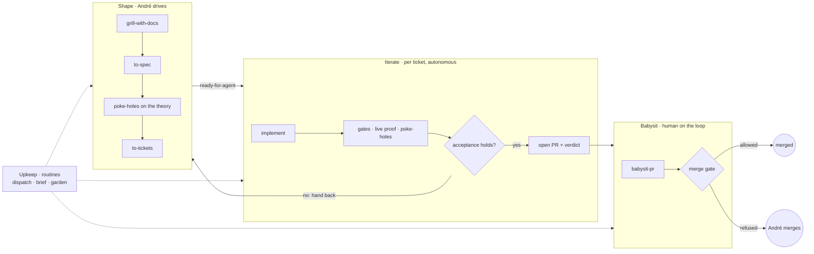
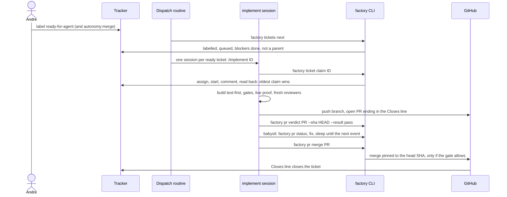
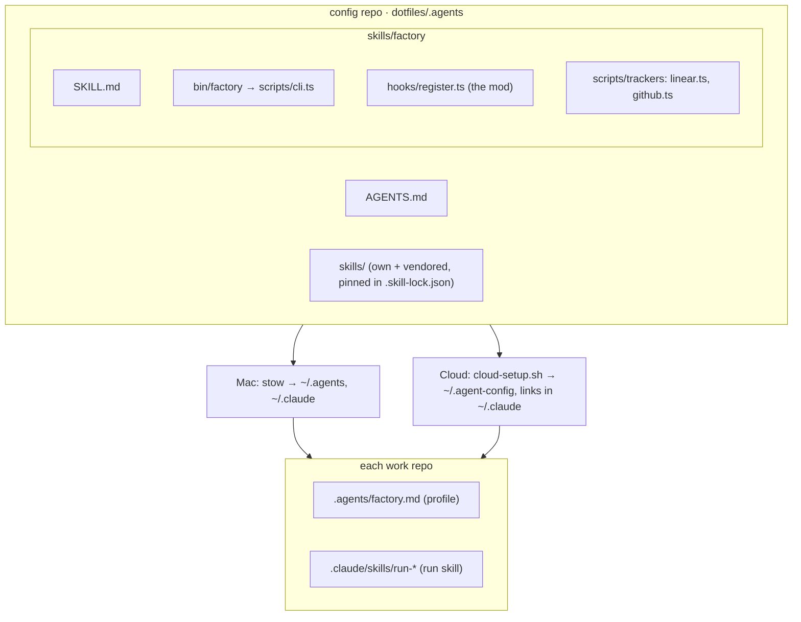

# Factory

The factory turns an approved ticket into a merged pull request with nobody
watching, and stops at the exact point where only André can move it. It runs
the same on the Mac and in Claude Code cloud sessions, and reads tickets from
Linear or GitHub Issues. The ideas behind it, and where each came from, are in
[INSIGHTS.md](INSIGHTS.md). Evals for its skills, and experiments still to run,
live in [andrezzoid/newsroom-evals](https://github.com/andrezzoid/newsroom-evals).

## Stages

| Stage | Driven by | Skills | Produces |
|---|---|---|---|
| Shape | André, interviewed | grilling, grill-with-docs, triage, to-spec, poke-holes, to-tickets | approved tickets with blocking edges |
| Iterate | an agent per ticket | implement, test-driven-development, poke-holes | a PR with live evidence and a recorded verdict |
| Babysit | an agent per PR | babysit-pr | a merged PR, or a brief saying what André must do |
| Upkeep | routines, or André | factory (dispatch, brief, garden), retro, hillclimb, correct | started sessions, the standing brief, a garden log, new guards |

Shape is the only stage that changes what a ticket means. When Iterate finds
that acceptance cannot hold, it hands the ticket back instead of absorbing the
change, and the definition is reshaped on André's command. Tickets that arrive
without a grilling session, from André's notes or from other people, go
through Matt Pocock's `triage`, whose agent brief uses the same ticket template
as `to-tickets`.

## A ticket's life

## Who decides what

| Decision | Owner | Mechanism |
|---|---|---|
| What to build | André | grilling, to-spec, to-tickets, his approval |
| Whether to start | André | `ready-for-agent` label |
| Whether it may merge itself | André, then the repo | `autonomy:merge` label, capped by the repo profile |
| Which ticket is next | CLI | `factory tickets next` |
| Who works it | CLI | `factory ticket claim`: first write, oldest claim in a 15-minute window wins |
| Whether it works | agent, then fresh agents | gates, the app started through `/run`, poke-holes, `factory pr verdict` |
| Whether GitHub would merge it | CLI | `factory pr status`: conflicts, threads, CI, reviews, in that order |
| Whether it merges | CLI | `factory pr merge`, below |
| What André must look at | CLI, then agent | `factory brief`, written up by `/factory brief` |

Skills hold judgment. Everything with one right answer lives in the `factory`
CLI, so every session reaches it the same way.

## Learning

Four skills change the harness, or a repo's guards, from what went wrong. They
belong to Upkeep: André or a routine starts them, never a ticket.

| | Finds | Fixes |
|---|---|---|
| One session | `retro` (Matt Pocock's): candidates ranked by severity, in seven kinds: navigation pointers, automated checks, reviewer rules, AGENTS.md trims, tool economy, no-op instructions, information access | `hillclimb`: a wording change to a skill or AGENTS.md, kept only when it improves both the cases it was tuned on and held-out ones |
| Repo history | `/factory garden`: classes of mistake that happened at least twice in two weeks of PRs, reverts and hand-backs | `correct`: makes one class impossible, trying architecture, then types, then a lint, then a test, and docs last |

A candidate whose fix is a check, a test or a `CODING_STANDARDS.md` rule gets
written directly: a check proves itself. Only wording changes go to
`hillclimb`, because only an eval shows that wording changed what agents do.
`hillclimb` first searches past sessions for other occurrences of the failure,
and each one, cut at the turn before the mistake, becomes an eval case. Fewer
than two occurrences means it is not a failure mode yet. Past sessions exist
only on the Mac, in `~/.claude/projects`, kept for ten years; cloud sessions
keep none, so `hillclimb` runs locally.

## Pieces

- **Skills** live once, in `dotfiles/.agents/skills`. `dotfiles/.claude/skills`
  links to them, so Claude Code and every harness that reads `~/.agents` load
  the same files. Third-party skills are vendored and pinned, so they can be
  tuned and still diffed against upstream.
- **The `factory` CLI** is zero-dependency TypeScript run by Node 22.18+ type
  stripping. `bin/factory` is the entry point.
- **The factory mod.** The factory skill folder is also a Claude Code mod,
  loaded from `~/.claude/skills/factory` with nothing in `settings.json`. At
  session start it puts `bin/` on PATH; in the cloud it re-runs
  `cloud-setup.sh`, which pulls the latest harness. On every tool call it denies
  a raw merge (`gh pr merge`, the merge API, the GitHub MCP merge tools) and a
  plain force push. It applies inside subagents too.
- **The repo profile**, `.agents/factory.md`, written by `/setup-factory`:
  tracker, max autonomy, merge method, gates and one-way doors.
  The CLI reads it from the base branch, so a branch cannot raise its own
  autonomy.
- **The run skill**, `.claude/skills/run-<name>/`, recorded by Claude Code's
  built-in `/run-skill-generator`, which only André can start, so
  `/setup-factory` asks him to. Agents start the app through the built-in
  `/run`, which loads it. Without one a repo stays at autonomy `pr`. The
  built-in `/verify`, also André's to start, uses a `run-*` skill as its
  handle; it records `.claude/skills/verify/` only after working out the
  steps with no run skill, so in a factory repo the run skill is the one
  recipe both use. The same shape fits any repo-specific procedure: one global
  entry skill that loads the repo's `<verb>-<name>` recipe, written the first
  time it is needed.

## Trackers

Ticket policy works on one normalized ticket; each tracker is an adapter
behind the same interface (`scripts/trackers/types.ts`). Adding Todoist means
adding one adapter.

| | Linear | GitHub Issues |
|---|---|---|
| Id | `ENG-123` | `owner/repo#12`, or `#12` inside a clone |
| Enabled by | `LINEAR_API_KEY`, or `linear auth login` on the Mac | `FACTORY_GITHUB_REPOS`, or a profile naming GitHub |
| Queued / started | workflow state type | open / open with `in-progress` |
| Blockers | "blocked by" relations | issue dependencies, or a `## Blocked by` section |
| Parent | children | sub-issues |
| Repo | `Repo: owner/name` line in the body | the issue's repository |
| PR closes it with | `Closes ENG-123` | `Closes #12` |
| Transport | GraphQL over fetch | `gh api` REST only: cloud sessions block GitHub GraphQL |

In a cloud environment on Pro or Max, the Linear key can be an API credential
the proxy adds to requests; `LINEAR_API_KEY=proxy-injected` tells the CLI to
send none of its own.

## Events

| Event | Cloud | Mac |
|---|---|---|
| Ticket queued | hourly dispatch routine | `/factory dispatch --here` |
| Activity on a PR opened in the cloud | `subscribe_pr_activity` wakes the session that owns it | n/a |
| Activity on a PR opened on the Mac | label it `factory`: a GitHub-event routine babysits it | Monitor on `factory pr watch` |
| Morning | brief routine, weekdays | `/factory` |
| Weekly | garden routine per repo | `/factory garden` |

Neither Linear nor GitHub issue events can start a routine, so dispatch polls
hourly. `/setup-factory cloud` gives each routine's exact trigger, repositories
and prompt.

## The merge gate

`factory pr merge` merges only when all of these hold, and pins the merge to
the head SHA it checked:

- GitHub reports the PR mergeable, CI green, no unresolved review thread and no
  changes requested. Threads it cannot read block the merge.
- Either André said "merge" in words (`--human-approved`), or every one of:
  - the ticket the PR names, in its branch or its `Closes` line, carries
    `autonomy:merge`, and the profile allows `merge`;
  - a run skill (`.claude/skills/run-*/SKILL.md`) exists on the base branch;
  - CI has reported at least one passing check on the head, since GitHub lists
    no checks for a few seconds after a push;
  - a passing verdict marker, written by the identity running the factory as
    the last line of its comment, names this head SHA or a byte-identical patch
    (`git patch-id` is not used: it ignores whitespace, which is code in Python
    and YAML);
  - the diff touches no one-way door, and GitHub did not truncate the file list.
    The profile itself is always a door, so no PR can loosen the rules for the
    PRs after it. Door globs match dotfiles: `infra/**` covers `infra/.env`.

The mod stops an agent drifting onto the short path; it does not stop one set
on getting through, since a script can still call the API. The wall is the
forge: a repo whose profile allows `merge` requires its CI checks in branch
protection.

## Known gaps

- The cloud review-thread route (`ccr/review_threads`) returned an empty list
  in every probe, so its non-empty shape is a guess. The parser returns
  "unreadable" for a shape it does not know, which blocks the merge.
- The mod reads shell text, not intent: a merge from a script file, a GraphQL
  query read from a file (`-F query=@m.graphql`) or another language gets past
  it, and so does merging a branch locally and pushing the base branch. It also
  blocks a harmless GET on a PR's merge route.
- Whether a GitHub-event routine's session receives the PR is not documented;
  the babysit prompt falls back to the repo's open PRs labelled `factory`.
- Whether routine sessions can call `create_session` is not documented. When
  they cannot, `/factory dispatch` lists the commands instead of launching.
- `claude --bg -w` dispatches locally only after the repo's workspace is
  trusted: run `claude` once interactively in each repo first.
- The Linear queries are validated against Linear's schema, a mock server and
  a live authentication check, but have never run against a real workspace.
  The GitHub adapter ran against a real repository with no labelled issues.
  The first `factory doctor` on real data is the first full live run.
