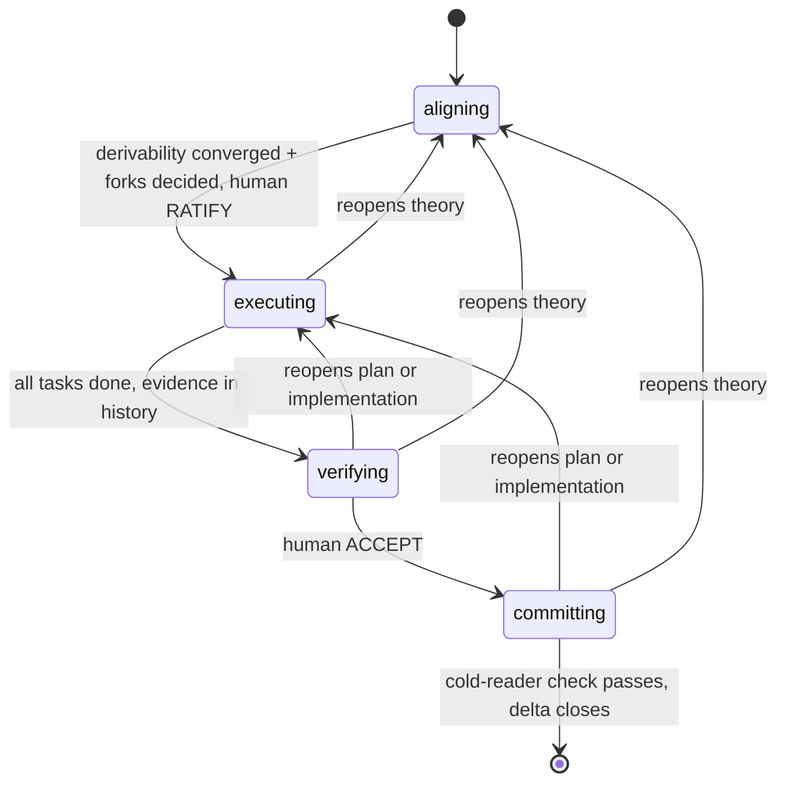

# Delta-Driven Development

## Overview

A **delta** is a human-aligned unit of change run by an agent: an *alignment-preserving transaction on a shared theory*. It opens only when human and agent share a theory of the change, aborts back to alignment the moment reality contradicts that theory, and commits atomically — code, durable context, and the human's understanding advance together, or the delta isn't done.

The alignment bar is Naur's: the real program is the theory its team holds, which text alone cannot carry — *"an essential part of any program, the theory of it, is something that could not conceivably be expressed, but is inextricably bound to human beings"* (Naur, *Programming as Theory Building*). Aligned means the human could predict the plan and even write the code. A program dies when its theory-holders dissolve, so a delta grows that shared theory, then harvests it into homes that outlive the delta.

All state lives in one file per delta, `.deltas/<name>.md` — the sole inter-session memory and every subagent's briefing. Routing is **syntactic**: frontmatter `state` decides where you are, because "is this done?" can't be trusted to the doer. The **conductor** (the session agent who builds the theory with the human) authors the delta and spawns every other context; it authors **no product code and no checks**, so the theory-holder stays on theory (context rot is theory rot — Naur) and evidence stays decorrelated from authorship. States model **authority**, not activity:

## When to Use

The default for non-trivial work — enter whenever the change needs a theory; skip only when it's one sentence with one obvious implementation. Size is self-limiting: `## Theory` + `## Acceptance` stay holdable in one sitting — a screen, not a wall. Ambitions whose theory can't stay holdable become *sequential* deltas — no hierarchies, no epics.

## Core Process

### 1. Route to the current state, and conduct it

Find or create `.deltas/<name>.md` — one file per delta, sections in normative order: **Theory, Acceptance, References, Glossary (optional), Open, Tasks, Followups**. Two rules bind the routing surface; the rest of the file's shape is detailed in [delta-file.md](references/delta-file.md) and recalled by each state's reference where it bites:

- **Frontmatter `state` is the only routing surface.** New delta starts `state: aligning`. There is no `ratified` field — ratification is the diff that flips `state` in direct response to the human's word; a field restating derivable state can lie.
- **Log = git:** every consolidation and transition commits the delta file. The diffs are the record, the content at each commit the *why*, messages natural summaries.

Then open the current `state`'s reference (below) and let it drive — it carries that state's procedure, boundary check, and exit. At each state entry, **load its skills explicitly with the Skill tool** — explicit loading is structural recall; memory degrades silently:

| `state` (authority) | Loads (via Skill tool) | Reference |
|---|---|---|
| `aligning` (shared) | design-it-twice, deep-module-design, define-errors-away | [references/aligning.md](references/aligning.md) |
| `executing` (agent, in ratified theory) | per implementer: define-errors-away, test-driven-development, comments-as-design | [references/executing.md](references/executing.md) |
| `verifying` (non-author) | complexity-red-flags | [references/verifying.md](references/verifying.md) |
| `committing` (agent) | comments-as-design | [references/committing.md](references/committing.md) |

### 2. The check rules that bind every state

A boundary check is **never run by the artifact's author** — an author's verdict on its own work is self-report, not evidence (Goodhart: *"When a measure becomes a target, it ceases to be a good measure."*). Non-author = a context that produced *none* of the artifacts under check; a fresh subagent briefed with the delta + its References qualifies.

- **Reviewers return findings; they never fix.** A reviewer that fixes becomes an author whose work then needs its own fresh check. Findings reopen the owning layer; the owning *state* fixes.
- **Re-verification after a repair is a full fresh pass**, never a confirmation the listed items got fixed — fixing-the-list is Goodhart's shortcut past fixing-the-problem.
- **Never narrate an unspawned reviewer:** claiming one ran is forged evidence. If spawning is unavailable, declare a reduction (the legitimate path) or stop. The conductor records returned findings as delta content; harness transcripts are the audit channel.
- **Reviewers are read-only on the shared working tree:** any checkout happens in a `git worktree` or exported tree — a verifier's `git checkout` once stranded the shared checkout on a detached HEAD (Opus S4).

### 3. Human gates: RATIFY and ACCEPT

RATIFY and ACCEPT are words **only the human can write**. The agent flips `state` across a human gate *only in direct response to the human's granting message*; an agent-initiated crossing is forgery regardless of work quality (both flavors showed up in evals — ratifying for the human, accepting on the verifier's behalf). The verifier's evidence is *grounds* for the human's ACCEPT, never a substitute. These are bright lines, not norms: norm-shaped gate rules lose to completion pressure, so only a mechanically checkable phrasing ("contains no ratification request") holds.

### 4. Layered backflow

Work is layered **theory → plan → implementation**. Any finding, in any state, reopens the *lowest contradicted layer* — never a silent patch. Which layer is agent judgment, **declared in the delta edit that records it**: a silent reopen buries the contradiction the protocol exists to surface.

## Common Rationalizations

Each a real temptation observed in a session or eval (see `evals/`), not a hypothetical.

| Excuse | Reality |
|---|---|
| "Work is solid, the human agrees — I'll send the forks and RATIFY in one message" / "I'll flip to executing." | The anti-pattern (S1, every tier): completion pressure beats norms, and RATIFY is a word only the human can write. Drain `## Open`, converge derivability, let the human decide every fork — *then* request ratification, standalone, later. |
| "The verifier's evidence is clean — I'll ACCEPT on its behalf." | Evidence is grounds for the human's ACCEPT, never a substitute (Opus S4: self-ACCEPTed, irreversibly deleted the delta). |
| "I'll play the verifier myself and report what it would find." | A narrated reviewer is forged evidence — on the sub-frontier tier decorrelation collapsed to exactly this, zero spawns. Spawn it or declare a reduction. |
| "This check is overkill — I'll quietly scale it down." | Reductions are legitimate only when declared as delta content (S1: undeclared fork-grounding reduction); silence steals a decision the human is owed. |
| "Mid-task the theory looks off — I'll adapt as I code." | Executing is transcription; silent resolution buries the contradiction (a v1 failure mode). Abort, report, reopen the layer. |

## Red Flags

Observable symptoms, each from a recorded incident:

- One message carries both a fork question and a ratification request; or `state` flipped across a gate with no human RATIFY/ACCEPT before it.
- A boundary check with no spawn behind it, or run by a context that authored what it checked; a reviewer that fixed instead of returning findings; re-verification that confirmed a list instead of a fresh pass.
- The shared working tree changed — or sits on a detached HEAD — after a reviewer ran.
- A check reduced or skipped with no declaration; a mid-task discovery resolved in place; a task carrying a status mark.

## Verification

Confirm from artifacts, never memory:

- [ ] Delta file: frontmatter `state` only, normative order, third-person readable; frozen pair unchanged since ratification (else `state` is `aligning`); completion derived by running checks, not status marks.
- [ ] Each state loaded its sibling skills via the Skill tool; each boundary check ran non-author and returned findings (never fixed) — or a reduction is declared.
- [ ] Each gate crossing followed a human RATIFY/ACCEPT message, requested standalone after every fork was decided; findings reopened the lowest contradicted layer, declared.
- [ ] Close: followups dispositioned, harvest in carriers, cold-reader reconstruction laid beside frozen Theory, exactly one delta-driven skill remains, delta deleted.
